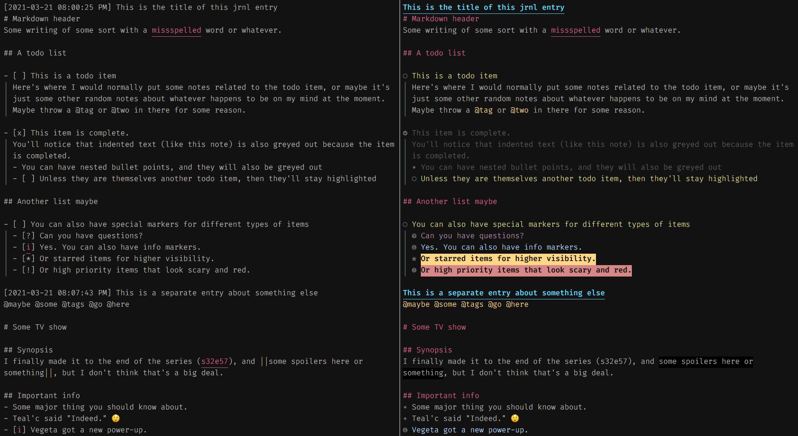

# Syntax for jrnl files in vim

This is a syntax file for neovim and vim to support [jrnl](https://github.com/jrnl-org/jrnl)
files. It's intended to work on top of the built-in `markdown` syntax (it might also work
with other markdown syntaxes, but I haven't tested it).

I've been using it personally for a few months, so the glaring bugs are ironed out, but
it's still in early development, so please report any issues you find.

While I'm open to adding new features, the current feature set reflects my own personal
usage of jrnl. My main use cases--in no particular order--are:
- Keeping a personal journal
- Writing posts about various media I watch or play (tv shows, movies, video games, etc)
  that I later post on social media
- Taking notes
- Making todo lists

## Screenshots
So that you know what you're getting, here's a screenshot of the same file without any
syntax highlighting (left), and with this plugin installed (right).




## Features
- Detects `.jrnl` file extension
- Supports jrnl header lines
- Supports [Nerd Fonts](https://www.nerdfonts.com/)
- Highlights jrnl tags (e.g. @tag)
- Todo boxes (requires conceal)
  - `- [ ]` Empty checkbox with highlighted line
  - `- [x]` Checked box with greyed indented text
  - `- [i]` Info icon
  - `- [i]` Question icon
  - `- [*]` Star icon
  - `- [!]` High priority item
  - `- [c]` Cancelled item (greyed out with an x instead of a check)
  - `- [.]` Current item (a la todo.txt)
- Nicer bullet points
- Spoiler tags
- Detects episode markers (e.g. s11e09), and exempt from spellcheck
- Folding
  - Level 1 fold on every jrnl entry
  - More fold levels for more higher markdown heading levels (e.g. `### Heading 3`)
  - Another fold level for a line starting with bolded text


## Caveats
As mentioned above, this has so far been my personal syntax file that is just now being
made into a standalone plugin. As such, it's not particularly well tested (although I do
use it daily).

I'm open to making this more widely usable for more users, but want new features to have
at least somewhat wide usage. Please feel free to suggest any new features, but be aware
that I decide not to add if I see the usage as too niche.

Also, I've been using neovim for a few years now, but recognize that a few years is
still considered relatively new in the vim community. This is my first plugin, and I'm
open to feedback, but please be kind.


## Installation
See a few example below, or refer to your plugin manager's documentation.

### [Packer][packer]

```lua
use 'wren/jrnl.vim'
```

### [Vundle][vundle]

```vim
Plugin 'wren/jrnl.vim'
```

### [vim-plug][plug]

```vim
Plug 'wren/jrnl.vim'
```

[packer]: https://github.com/wbthomason/packer.nvim
[vundle]: https://github.com/gmarik/vundle
[plug]: https://github.com/junegunn/vim-plug

